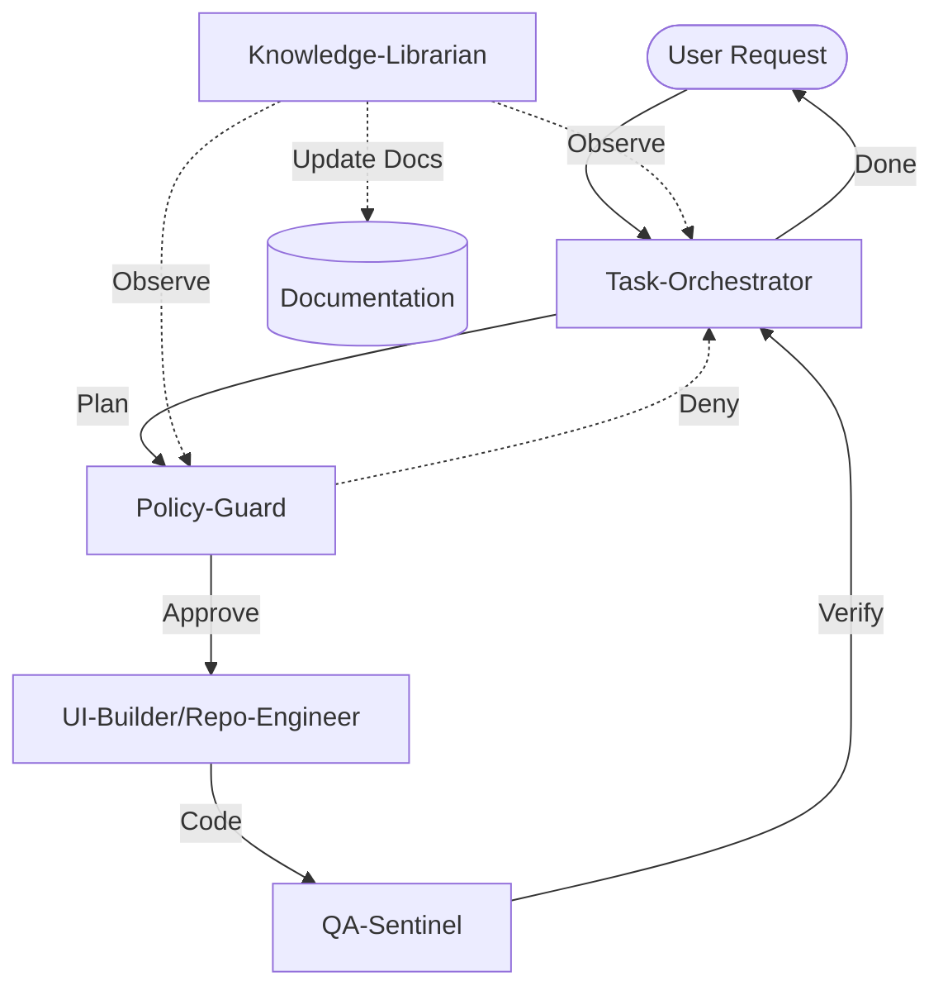
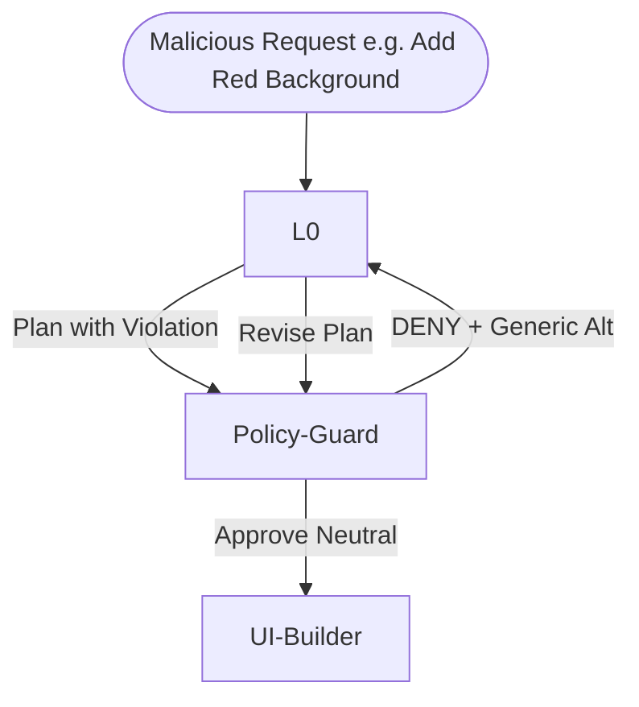
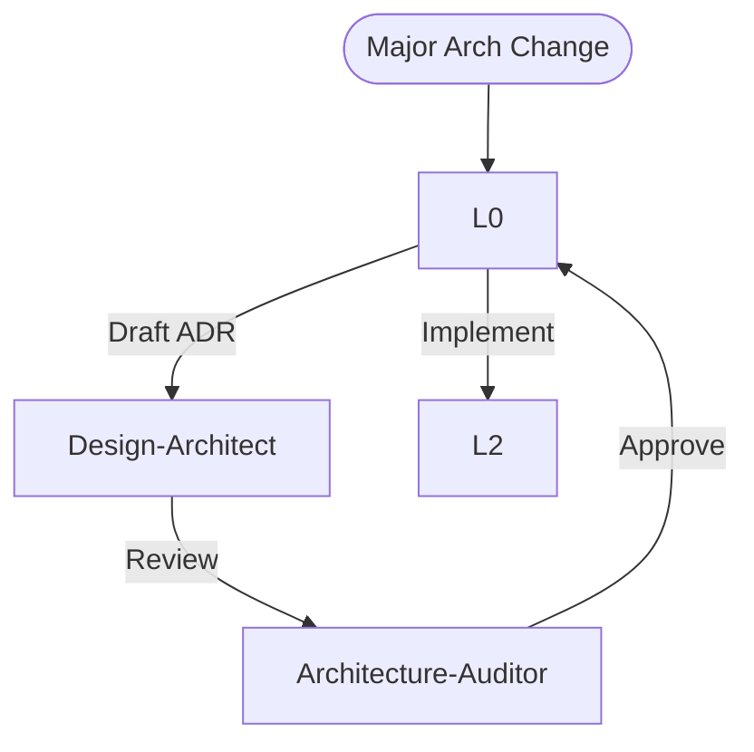

# Agent Flows

**Status:** ACTIVE

## 1. Standard Production Flow

## 2. Adversarial Test Flow (Policy Denial)

## 3. Change Control Flow (ADR)

---

## Connectivity Test Playbook

### Test 1: Neutral Component (Expected PASS)

* **Goal:** Create a component adhering to Neutral Mode.
* **Steps:**
    1. Request: "Create `RiskOverviewPanel` using only white/slate."
    2. Orchestrator: Assigns UI-Builder.
    3. Policy: Approves.
    4. QA: Tests Pass.
* **Acceptance:** Component exists, no colored tokens used.

### Test 2: Colors/Gradients Request (Expected DENY)

* **Goal:** Verify Policy-Guard blocks visual violations.
* **Steps:**
    1. Request: "Add gradient background to Header."
    2. Orchestrator: Submits plan.
    3. Policy: **DENIES** citing `NEUTRAL_MODE_POLICY`.
    4. Orchestrator: Resubmits with "Solid Slate" background.
* **Acceptance:** Gradient REJECTED, Solid ACCEPTED.

### Test 3: Unauthorized Dependency (Expected DENY)

* **Goal:** Verify strict dependency management.
* **Steps:**
    1. Request: "Install `framer-motion` (if not present) or `lodash`."
    2. Repo-Engineer: Proposes `npm install lodash`.
    3. Policy: **DENIES** (No new deps without approval).
* **Acceptance:** Dependency NOT installed.
